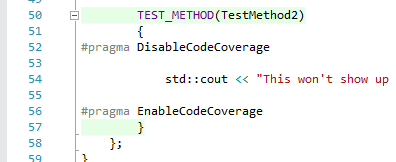

# VSOpenCPPCoverage

VSOpenCPPCoverage is a Visual Studio extension for OpenCPPCoverage. The combination provides you easy-to-use, light-weight C++ code coverage, right from Visual Studio. 

This extension works with both the 32-bit and 64-bit versions of OpenCPPCoverage. 

# Installation

Prerequisites: VS2013 or VS2015. Any edition should work, even though this is only tested on VS2015 Community.

- Install OpenCPPCoverage x64 and/or x86 from https://opencppcoverage.codeplex.com/ .
- Install this extension: https://github.com/atlaste/VSOpenCPPCoverage/raw/master/CoverageExt/CoverageExt.vsix .

# Getting started

Working with VSOpenCPPCoverage is a breeze. Basically install and use, there's nothing more to it:

- Either create a standard C++ / MS Test application, or run a simple C++ / console application. Note that OpenCppCoverage assumes that there is no user input during the test run.
- Build your solution in Debug mode.
- Right-click in solution explorer on the test or application project, click "Run code coverage".
- Open a file that you want to show coverage info for. If the file is already open, close it and open it again. 
- For an overview, go to Tools -> Coverage report

# Features

- Highlighting covered and uncovered code directly from Visual Studio:

- Report generation of covered code (Tools -> Coverage report):

- Run code coverage on VS unit tests (Right click VS project -> Run code coverage):

- Hide code from code coverage results using #pragma DisableCodeCoverage and #pragma EnableCodeCoverage:

- The CodeCoverage output window will give you the current status of the process. Stdout is forwarded here as well.
- If you don't use MSTest, you can still use the Cobertura XML file generated by OpenCPPCoverage as "CodeCoverage.xml" to the solution folder.
- Small memory footprint and fast. Data is stored in a simple bit vector. Even if you have a million lines of code, VSOpenCPPCoverage will only use 250 KB of memory.

# Support and maintenance 

At NubiloSoft, we use this VSOpenCPPCoverage addin on a daily basis in a real environment on a huge C++ code base. We want this to be good. And since this is not our core 
business, we are willing to make it available for free. Simple as that. 

Over the period that we've used this extension, it has proven to be both reliable and stable, resulting in only a very few issues and very little work for us to maintain it. 
However, if you do find a bug or think the tool lacks a feature, please let us know by posting it in 'issues'. 

# License

Your friendly BSD license. Please give credits where credits are deserved.
