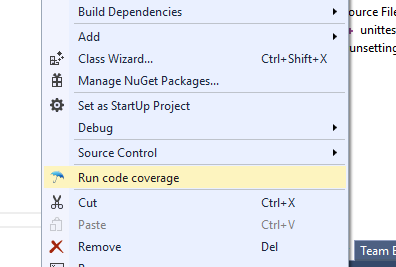

# Free C++ Code Coverage

CPPCoverage is a Visual Studio extension that calculates code coverage for C++ applications and Visual Studio C++ native tests. Basically it provides 
you easy-to-use, light-weight C++ code coverage, right from Visual Studio and with the features you expect from code coverage. 

# Installation

Prerequisites: VS2013 or VS2015. Any edition should work, even though this is only tested on VS2015 Community.

- Install this extension: https://github.com/atlaste/VSOpenCPPCoverage/raw/master/CoverageExt/CoverageExt.vsix .

# Getting started

Working with CPPCoverage is a breeze. Basically install and use, there's nothing more to it:

- Either create a standard C++ / MS Test application, or run a simple C++ / console application. Note that OpenCppCoverage assumes that there is no user input during the test run.
- Build your solution in Debug mode.
- Right-click in solution explorer on the test or application project, click "Run code coverage".
- Open a file that you want to show coverage info for. If the file is already open, close it and open it again. 
- For an overview, go to Tools -> Coverage report

# Features

- Highlighting covered and uncovered code directly from Visual Studio:

- Report generation of covered code (Tools -> Coverage report):

- Run code coverage on VS unit tests (Right click VS project -> Run code coverage):

- Hide code from code coverage results using #pragma DisableCodeCoverage and #pragma EnableCodeCoverage:

- IsDebuggerAttached is overwritten with 'return false'. 
- The CodeCoverage output window will give you the current status of the process. Stdout is forwarded here as well.
- Small memory footprint and very fast. Even if you have a million lines of code, CPPCoverage will only use kilobytes of memory for coverage.

# Support and maintenance 

CPPCoverage is 100% open source and 100% for free.

At NubiloSoft, we use this CPPCoverage addin on a daily basis in a real environment on a huge C++ code base. We want this to be good. And since this is not our core 
business, we are willing to make it available for free. Simple as that. 

Over the period that we've used this extension, it has proven to be both reliable and stable, resulting in only a very few issues and very little work for us to maintain it. 
However, if you do find a bug or think the tool lacks a feature, please let us know by posting it in 'issues'. 

# If the tool doesn't work...

There are a few likely suspects to check:

- Check the Coverage output window in Visual Studio!
- Are PDB's available? Can you debug the application? If not, code coverage won't work.
- If your (Native unit test DLL) unit tests aren't running in Visual Studio, they're also not running in the coverage tool. Obviously this is the same when you're using an executable.
- Is all your source code in a child folder of your solution? If not, you can run Coverage-x86 or Coverage-x64 as executable and store the output in the solution folder. 
Basically the recipe is as follows:

[install folder]\Resources\Coverage[-x86 / -x64].exe -o "[solution folder]\CodeCoverageTest.cov" -p "[root path of your code; omit the trailing '\']" -- "[executable to run...]" [... optional arguments...]

# Advanced users

Most people want to integrate code coverage in their test environment. Coverage-x86.exe and Coverage-x64.exe will provide just that. We support emitting Cobertura XML files, 
which can be processed by a lot of tools. 

If you want even more control, grab the code from the Coverage project, change the executable that's executed and you're done. 

# Measuring code coverage

In the early versions of this tool, we've used OpenCPPCoverage as an external dependency. And even though OpenCPPCoverage is pretty decent, we feel it just cannot deliver 
everything that we need. Therefore we've been working on a better alternative, which is available *now*:

- OpenCPPCoverage seems to be pretty heavy. We wanted something that's fast as hell, since we're measuring all the time. 
- The relevant #pragma's are handled by the coverage tool, so that files are properly ignored by the coverage engine.
- We're working with production-grade software, so we want the memory footprint of out coverage tool to be very small. 
- We want integration in our test suites. It makes little sense to run a separate memory leak checker, a separate coverage checker and a separate unit test runner. We want all 
  those things at once.
- Better handling of filters for "normal" solutions. We want to measure coverage on our solution, nothing more and nothing less.
- IsDebuggerAttached is giving us a hard time. We've implemented a nice workaround for this in the new coverage tool.
- We found that a lot of time was spent writing Cobertura files. Even though the new coverage tools support Cobertura XML files, it's not preferred. We've created a new 
  text-based file, which is way smaller and more suitable for code coverage. 

The projects Coverage-x86 and Coverage-x64 are the result of this, which provide this new coverage tool. For the most part it already works great; for 
most applications you don't even notice that coverage is being measured. 

# License

Your friendly BSD license. Please give credits where credits are deserved.
