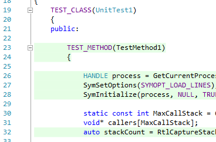

# VSOpenCPPCoverage

VSOpenCPPCoverage is a Visual Studio extension for OpenCPPCoverage. The combination provides you easy-to-use, light-weight C++ code coverage, right from Visual Studio. 

This extension works with both the 32-bit and 64-bit versions of OpenCPPCoverage. 

# Installation

Prerequisites: VS2013 or VS2015. Any edition should work, even though this is only tested on VS2015 Community.

- Install OpenCPPCoverage x64 and/or x86 from https://opencppcoverage.codeplex.com/ .
- Install this extension: https://github.com/atlaste/VSOpenCPPCoverage/raw/master/CoverageExt/CoverageExt.vsix .

# Getting started

Working with VSOpenCPPCoverage is a breeze. Basically install and use, there's nothing more to it:

- Either create a standard C++ / MS Test application, or run a simple C++ / console application. Note that OpenCppCoverage assumes that there is no user input during the test run.
- Build your solution in Debug mode.
- Right-click in solution explorer on the test or application project, click "Run code coverage".
- Open a file that you want to show coverage info for. If the file is already open, close it and open it again. 
- For an overview, go to Tools -> Coverage report

# Features

- Highlighting covered and uncovered code directly from Visual Studio:

- Report generation of covered code (Tools -> Coverage report):

- Run code coverage on VS unit tests (Right click VS project -> Run code coverage):

- Hide code from code coverage results using #pragma DisableCodeCoverage and #pragma EnableCodeCoverage:

- The CodeCoverage output window will give you the current status of the process. Stdout is forwarded here as well.
- If you don't use MSTest, you can still use the Cobertura XML file generated by OpenCPPCoverage as "CodeCoverage.xml" to the solution folder.

# License

Your friendly BSD license. Please give credits where credits are deserved.
